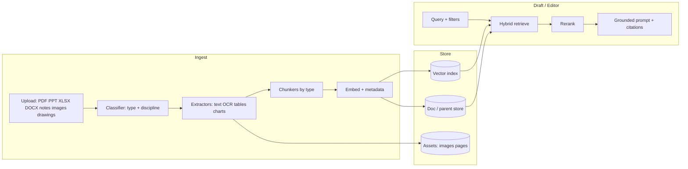

# Construction RAG Pipeline Plan

Today’s “RAG” is only an in-memory text bag (`rag-store.ts`): `.txt`/`.md` are stored whole, PDF/DOCX/etc. are **name-only stubs**, and there are **no embeddings**. Draft can attach “references,” but it is not real retrieval yet.

For construction + Draft (blogs, articles, case studies, experience shares), this is the design that fits.

---

## Recommended RAG type

**Hybrid multimodal RAG with parent-document retrieval and metadata filters.**

| Approach | Why it fits here |
|----------|------------------|
| **Hybrid (vector + keyword)** | Specs, clause IDs, material codes, drawing numbers need exact match *and* semantic match |
| **Parent-document / hierarchical** | Retrieve a small chunk, return the parent section/page so Draft gets full context (tables, clauses) |
| **Multimodal extraction at ingest** | Scanned PDFs, drawings, charts, photos must become text + structured metadata *before* indexing |
| **Metadata-filtered retrieval** | Scope by project, doc type (policy / drawing / cost / method), discipline, date |

Avoid: single global “dump everything into one vector store with fixed 500-token chunks” — that fails on drawings, Excel, and long policies.

---

## Core components

1. **Connectors / upload** — notes, PDF, DOCX, PPTX, XLSX/CSV, images, drawings (PDF/PNG/DWG later as image pages).
2. **Document classifier** — `policy | spec | method | drawing | cost | photo | presentation | notes | other` + optional discipline (structural, HSE, QS).
3. **Modality extractors**
   - Digital PDF/DOCX → text + layout
   - Scanned PDF pages → OCR (+ optional vision summary per page)
   - Tables → markdown/CSV rows + “table caption”
   - Charts → title, axes, series summary (vision or chart-data if Excel)
   - Drawings → sheet/rev if present, vision description of what is shown
   - Excel → sheet-level chunks + key ranges (materials, rates, quantities)
   - PPT → slide title + body + notes
4. **Chunkers (by type)** — section-aware for policies; row/sheet for Excel; slide for PPT; page/region for drawings.
5. **Embeddings** — text embeddings for all chunks; optional image embeddings for photos/drawing pages.
6. **Stores** — vector index + parent document store + asset store (page images, uploaded photos).
7. **Retriever** — hybrid search + filters (`projectId`, `docType`, `tags`).
8. **Reranker** (optional but useful) — cross-encoder on top-20 → top-5.
9. **Draft composer** — inject retrieved passages with **citations** (`[Source: Method Statement §4.2]`).

---

## Construction content loop (how pieces connect)

| Input | Extract | Chunk | Retrieve for Draft as |
|-------|---------|-------|------------------------|
| Policies / HSE | Text sections | By heading / clause | Safety / compliance paragraphs |
| Specs / standards | Clauses, tables | Clause-level parents | “Must include” / Against brief |
| Method statements | Sequence, plant, risks | Section parents | Case study / technical guide body |
| Cost sheets (Excel) | Sheets, tables | Sheet + named ranges | Materials, rates, quantities |
| Charts in PDF/PPT | Vision or embedded data | Chart summary chunk | Evidence / KPI callouts |
| Scanned PDFs | OCR per page | Page + parent doc | Same as text policies |
| Drawings / notes photos | Vision description + OCR labels | Asset + caption chunk | Figure placement (like your draft photos) |
| PPT | Slide text + notes | One chunk per slide | Experience share / toolbox outline |

**Ingest loop (once per upload):**  
upload → classify → extract → chunk → embed → index → return `sourceId` + warnings.

**Draft loop (every generate):**  
user brief (type, audience, topic) + selected sources → retrieve top-k (filtered) → optional rerank → build grounded prompt → write article/blog/case study → attach citations + optional images (vision placement you already have).

---

## Draft integration (blogs, articles, case studies, experience)

Keep the current Draft UI, but make **References** a real project library:

1. User uploads notes / PDF / Excel / PPT / drawings / photos.
2. Pipeline indexes them (not “filename only”).
3. User picks sources (or “use all project docs”).
4. On **Generate**:
   - Retrieve relevant chunks for topic + content type
   - If photos attached → vision placement (already working)
   - If drawings/scanned pages in library → retrieve their captions/OCR as evidence
5. Output draft with **source footnotes** so it is not hallucinated policy/cost data.

Content-type bias (retrieval filters):

| Draft type | Prefer sources |
|------------|----------------|
| Article / blog | Photos, progress notes, PPT |
| Case study | Method, costs, outcomes, drawings |
| Experience share | Notes, photos, incident/QA docs |
| Technical guide | Specs, policies, tables, checklists |

---

## What to build in phases

**Phase 1 — Real text RAG (unblocks Draft)**  
PDF/DOCX/TXT/MD extract → section chunking → embeddings → hybrid retrieve → Draft uses retrieved text (replace in-memory stub).

**Phase 2 — Tables & Excel**  
XLSX/CSV + PDF tables → structured chunks → cost/material Q&A and Draft “must include” numbers.

**Phase 3 — Scans & drawings**  
OCR + page vision summaries → parent page retrieval → figure-aware Draft.

**Phase 4 — PPT + charts**  
Slide/chart summaries → social/blog packs and KPI callouts.

**Phase 5 — Project workspace**  
Per-project corpus, shared glossary/specs, permissions, cost tags on RAG queries (`rag`, `retrieve`).

---

## Decision summary

| Question | Answer |
|----------|--------|
| Best RAG type? | **Hybrid + parent-document + metadata filters**, multimodal **at ingest** |
| Why not plain vector RAG? | Construction needs clause IDs, tables, drawings, and citations |
| How Draft uses it? | Retrieve → ground prompt → write + cite; photos stay on vision placement path |
| First build? | Phase 1: real PDF/DOCX ingest + embeddings + retrieve into Draft |

If you want to implement next, Phase 1 is the right start: replace `rag-store` with chunked embeddings and wire Draft’s reference list to real retrieval (no more “filename only” PDFs).
